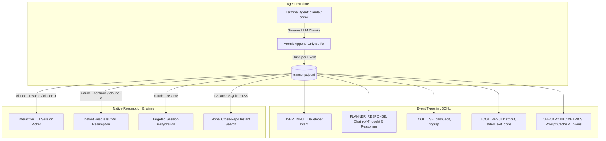

# Under the Hood of AI Coding Agents: Decoding transcript.jsonl and Mastering Built-In Session Resumption

*When your AI terminal agent runs for 45 minutes, executes 30 shell commands, modifies 12 files, and self-corrects after compiler errors—how does it actually record that trajectory? Here is a deep technical breakdown of the JSONL transcript architecture, event schemas, and every built-in option to inspect and resume sessions.*

---

Developers running autonomous coding agents like **Claude Code CLI** and **OpenAI Codex** spend hours in the terminal pair-programming with LLMs. Unlike standard web chat interfaces, terminal agents aren't just generating text: they read local directory trees, execute bash commands, run test suites, apply AST diffs, and inspect build output.

When the terminal window closes, or when a session crashes mid-command, your entire pair-programming trajectory is preserved in a local file named `transcript.jsonl` (or `rollout-*.jsonl`).

Understanding this file structure and the native CLI commands available to manipulate it gives you total control over your AI developer environment.

---



---

## 1. Why JSONL? The Architecture Behind Append-Only Transcripts

Most developers encountering `transcript.jsonl` ask: **Why not standard JSON or a local SQLite database?**

The decision to use **JSON Lines (JSONL)**—where each individual line is a standalone, valid JSON string separated by `\n`—is a masterclass in resilient systems design for streaming agentic runtimes.

### A. $O(1)$ Append-Only Streaming Performance
When Claude Code or Codex communicates with Anthropic or OpenAI API servers, response tokens stream back via Server-Sent Events (SSE). 

If transcripts were stored in a standard JSON array (`[ {event1}, {event2} ]`):
* Adding event 500 would require re-reading, parsing, modifying, and serializing a multi-megabyte JSON file on disk.
* File I/O would grow quadratically with conversation length.

With JSONL, persisting a new event is a simple, constant-time append operation:
```c
// Pseudo-code of an append-only agent logger
FILE *f = fopen("transcript.jsonl", "a");
fprintf(f, "%s\n", serialized_event_json);
fflush(f);
```

### B. Crash-Resilience Guarantee (Zero Data Corruption)
Autonomous agents frequently execute dangerous terminal commands: running Docker containers, stress tests, background daemons, or compiler toolchains.
* If a runaway build process triggers the kernel Out-Of-Memory (OOM) killer,
* If the user presses `Ctrl+C` (SIGINT) mid-generation,
* Or if your MacBook battery abruptly dies,

A monolithic JSON file will be left with an unclosed bracket or truncated object, permanently corrupting the entire session history.

In JSONL, **every preceding line is already completely valid**. Even if the very last line is truncated, a parser simply discards the incomplete tail line with `tail -n +1` and recovers 100% of the prior trajectory intact.

### C. Low-Memory Streaming Parsers
When an agent session reaches 200 turns (spanning 150,000+ tokens and tens of megabytes of logs), reading the transcript doesn't require loading the whole file into RAM. Utilities like `readline()`, Unix pipes (`jq`, `grep`, `tail -f`), and background indexers can process transcripts line-by-line with $O(1)$ memory consumption.

---

## 2. Dissecting the JSONL Event Schema

Let's look at the actual anatomy of a Claude Code / Codex transcript. Each line in `transcript.jsonl` represents an atomic step in the agent's execution loop.

### Turn 1: The User Input (`USER_INPUT`)
```json
{
  "step_index": 1,
  "source": "USER_EXPLICIT",
  "type": "USER_INPUT",
  "status": "DONE",
  "timestamp": "2026-10-03T14:22:10.450Z",
  "content": "Add idempotent webhook retry logic to payment_service.go with exponential backoff.",
  "metadata": {
    "git_branch": "feature/payments",
    "git_commit": "a8f9c12",
    "cwd": "/Users/developer/repos/billing-engine"
  }
}
```

### Turn 2: The Model's Internal Reasoning (`PLANNER_RESPONSE`)
Before issuing a tool command, the agent generates its internal thought chain and declares the tools it intends to invoke:
```json
{
  "step_index": 2,
  "source": "MODEL",
  "type": "PLANNER_RESPONSE",
  "status": "DONE",
  "timestamp": "2026-10-03T14:22:15.120Z",
  "content": "I need to inspect payment_service.go to locate the existing WebhookHandler function and find how database transactions are structured.",
  "tool_calls": [
    {
      "name": "run_command",
      "args": {
        "CommandLine": "grep -n 'func WebhookHandler' payment_service.go",
        "WaitMsBeforeAsync": 5000
      }
    }
  ],
  "usage": {
    "input_tokens": 1420,
    "cache_creation_input_tokens": 0,
    "cache_read_input_tokens": 1280,
    "output_tokens": 86
  }
}
```
> **Notice the `usage` object:** Notice `cache_read_input_tokens: 1280`. Modern agents rely on Anthropic and OpenAI prompt caching. Resuming warm sessions costs up to **90% less** and responds in a fraction of the time because static repository context is cached in memory.

### Turn 3: The Tool Execution Result (`TOOL_RESULT`)
When the shell or file tool finishes, its stdout, stderr, and exit status are recorded as a new line:
```json
{
  "step_index": 3,
  "source": "SYSTEM",
  "type": "TOOL_RESULT",
  "status": "DONE",
  "timestamp": "2026-10-03T14:22:15.890Z",
  "content": "42:func WebhookHandler(w http.ResponseWriter, r *http.Request) {\n",
  "tool_call_id": "call_98x12a",
  "exit_code": 0
}
```

### Turn 4: Context Compaction (`COMPACTED_SUMMARY`)
When the conversation approaches the model's maximum context window (e.g. 200,000 tokens), the agent triggers an internal summarization turn:
```json
{
  "step_index": 48,
  "source": "SYSTEM",
  "type": "COMPACTED_SUMMARY",
  "timestamp": "2026-10-03T14:55:00.000Z",
  "compacted_range": [1, 45],
  "summary": "User requested idempotent webhook logic. Verified payment_service.go. Applied exponential backoff helper. Ran go test ./... which passed. Currently addressing PostgreSQL unique index migration."
}
```
Understanding this schema allows you to write custom scripts to query, audit, or visualize any session.

---

## 3. Native CLI Commands: Viewing & Resuming Sessions

You do not need external tools to perform basic session management. Both Claude Code and OpenAI Codex provide built-in command-line flags and interactive pickers.

### A. Claude Code CLI Native History Flags

| Command | Shorthand | What It Does Under the Hood |
| :--- | :--- | :--- |
| `claude --resume` | `claude -r` | Opens an **interactive terminal UI (TUI)** listing all past sessions in the current directory, ordered by date. |
| `claude --resume <session_id>` | `claude -r <id>` | Immediately mounts and rehydrates the specific session matching `<session_id>`. |
| `claude --continue` | `claude -c` | Skips the picker and **instantly resumes the most recent session** in the current workspace. |
| `claude --print` | `claude -p` | Non-interactive mode: executes a prompt or reads the last turn and prints the output directly to stdout for Unix piping. |

#### Using the Interactive Picker (`claude -r`)
When you type `claude -r` inside your repository, Claude Code reads all `transcript.jsonl` files registered under that project's hash and presents a terminal selector:

```text
? Select a session to resume:
  ❯ [2026-10-03 14:22] Add idempotent webhook retry logic (14 turns)
    [2026-10-02 18:40] Fix memory leak in WebSocket client (32 turns)
    [2026-10-01 09:15] Migrate PostgreSQL schema for audit logs (8 turns)
    [2026-09-28 11:02] Initialize Vite configuration with Tailwind (5 turns)
```
Use arrow keys to highlight the session and press `Enter`. The CLI reloads the entire context into memory, re-warms the prompt cache, and lets you continue typing as if the terminal had never closed.

#### In-Session Slash Command (`/history`)
If you are already inside an active Claude Code interactive session, you can inspect or jump between turns without leaving the prompt:
* `/history` – Displays the active session's turns and token metrics.
* `/clear` – Clears conversation context while preserving CLAUDE.md guidelines.
* `/compact` – Manually triggers a conversation summary to free up token budget.

#### Where Transcripts Live on Disk
* **macOS & Linux:**
  ```bash
  ~/.claude/projects/<sanitized-workspace-path>/transcript.jsonl
  ```
  *(Example: `/Users/dinesh/tech/billing` becomes `~/.claude/projects/Users-dinesh-tech-billing/transcript.jsonl`)*
* **Windows:**
  ```powershell
  %USERPROFILE%\.claude\projects\<sanitized-workspace-path>\transcript.jsonl
  ```

---

### B. OpenAI Codex CLI Native History Commands

OpenAI Codex uses a date-partitioned rollout layout on disk:
```bash
~/.codex/sessions/YYYY/MM/DD/rollout-<timestamp>-<uuid>.jsonl
~/.codex/memories.sqlite
```

#### Native Commands:
* `codex resume` – Lists recent rollout logs in the active directory and lets you pick one to resume.
* `codex resume <session-uuid>` – Directly restarts the session with previous tools and scratchpad variables intact.
* `codex list` – Displays a tabular list of recent session IDs, token totals, and run durations.

---

### C. GitHub Copilot & VS Code Session Storage

If you use GitHub Copilot Chat or Copilot Edits inside Visual Studio Code, sessions are recorded by the VS Code Chat Subsystem:
* **macOS Storage Path:**
  ```bash
  ~/Library/Application Support/Code/User/workspaceStorage/<workspace-hash>/chatEditingSessions/
  ```
* **Native In-Editor History Navigation:**
  * Open the Command Palette (`Cmd + Shift + P` on Mac, `Ctrl + Shift + P` on Linux/Windows).
  * Type: `Chat: Show Previous Chats...`
  * An interactive drop-down appears containing past Copilot Chat conversations for that workspace.
  * To export a transcript: run `Chat: Export Chat...` to save the active thread as JSON or Markdown.

---

## 4. Power-User Terminal Recipes: Querying JSONL with `jq`

Because JSONL is plain text, standard Unix command-line utilities can parse, extract, and audit your sessions at blistering speeds.

### 1. Extract All Developer Prompts from a Session
```bash
jq -r 'select(.type=="USER_INPUT") | "\(.timestamp) ❯ \(.content)"' transcript.jsonl
```
*Output:*
```text
2026-10-03T14:22:10Z ❯ Add idempotent webhook retry logic to payment_service.go
2026-10-03T14:31:05Z ❯ Now run the unit tests and fix any failing mock expectations
2026-10-03T14:40:12Z ❯ Extract the retry loop into a reusable package
```

### 2. Audit Every Shell Command Executed by the AI
Ever wonder what shell commands your agent ran while you stepped away for coffee?
```bash
jq -r 'select(.type=="PLANNER_RESPONSE") | .tool_calls[]? | select(.name=="run_command") | .args.CommandLine' transcript.jsonl
```
*Output:*
```bash
grep -n 'func WebhookHandler' payment_service.go
go test -v ./...
git diff --stat
```

### 3. Calculate Your Total Token Usage & Prompt Cache Hit Rate
Find out how many tokens were read from prompt cache vs processed as fresh input:
```bash
jq -s '
  map(.usage // empty) | {
    total_input: map(.input_tokens // 0) | add,
    cache_read: map(.cache_read_input_tokens // 0) | add,
    total_output: map(.output_tokens // 0) | add,
    cache_hit_ratio: ((map(.cache_read_input_tokens // 0) | add) / (map(.input_tokens // 0) | add) * 100 | round)
  }
' transcript.jsonl
```
*Output:*
```json
{
  "total_input": 184500,
  "cache_read": 162360,
  "total_output": 4210,
  "cache_hit_ratio": 88
}
```
*(An 88% cache hit ratio means you paid roughly one-tenth the cost of cold prompt requests!)*

### 4. Find All Files Modified Across the Session
```bash
jq -r 'select(.type=="PLANNER_RESPONSE") | .tool_calls[]? | select(.name=="replace_file_content" or .name=="write_to_file") | .args.TargetFile' transcript.jsonl | sort -u
```

---

## 5. The Limitations of Native CLI Resumption

While `claude --resume` and `codex resume` are indispensable, power users quickly encounter critical limitations when managing large multi-repository projects:

| Limitation | Native CLI (`claude -r` / `codex resume`) | The Problem for Developers |
| :--- | :--- | :--- |
| **Directory Isolation** | Scope limited to `cwd` only. | If you touched 4 microservices today, you must `cd` into each folder individually to check what was run. |
| **No Full-Text Search (FTS)** | Can only search by initial session prompt. | Searching for a specific regex, SQL query, or error message generated inside turn 14 requires manual `grep`. |
| **Dense Terminal Output** | TUI truncated to 80-120 columns. | Reading complex 200-line code diffs or stack traces in the terminal scrollback causes eye fatigue. |
| **No Cross-Agent Indexing** | Claude, Codex, Copilot logs are siloed. | There is no single place to search past reasoning across all models. |

---

## 6. Visualizing & Searching Sessions: Free Web Viewer & L2Cache

To eliminate these blind spots, we built two dedicated, privacy-first solutions that require zero cloud uploads:

### 1. Free In-Browser Session Viewer (All Platforms)
If you have a `transcript.jsonl` or `rollout-*.jsonl` file and want an instant, beautiful visual breakdown:
* Open the **[Free Claude & Codex Session Viewer](https://l2cache.amvo.store/en/tools/claude-session-viewer)** on `l2cache.amvo.store`.
* Drag and drop your `.jsonl` file.
* It parses the entire transcript locally in your browser (100% client-side Web Worker, zero bytes uploaded).
* You can filter by User Prompts, Tool Invocations, Shell Commands, File Edits, and Error Spikes with instant syntax highlighting and token breakdown.

### 2. L2Cache for Mac: Instant Cross-Project Search
If you are on macOS and want an ambient, background indexer:
* **[L2Cache for Mac](https://apps.apple.com/us/app/l2cache/id6774423992?mt=12)** monitors `~/.claude/projects/` and `~/.codex/sessions/` in real time.
* It indexes every turn into an embedded **SQLite FTS5 (Full-Text Search)** database.
* Press `⌥ Space` (Option+Space) from anywhere on your Mac to summon the floating search bar: search any prompt, bash snippet, or tool output across all repositories.
* Click **"Resume in Terminal"** to launch your terminal directly into that project and resume the session with one keystroke.

---

## Summary Checklist: Mastering AI Coding History

1. **Remember JSONL is append-only:** You never have to worry about a crashed terminal corrupting your transcript.
2. **Resume warm sessions:** Always run `claude --continue` (`claude -c`) or `claude --resume` (`claude -r`) instead of starting fresh to leverage Anthropic's 90% prompt cache discount.
3. **Audit with `jq`:** Use one-liners to inspect shell commands and file changes before merging pull requests.
4. **Inspect visually:** Use the [Free In-Browser Claude & Codex Session Viewer](https://l2cache.amvo.store/en/tools/claude-session-viewer) to review complex sessions without terminal squinting.
5. **Keep a local index:** Turn your ephemeral AI sessions into a permanent, searchable engineering memory.

---

*Published by the engineering team at [L2Cache](https://l2cache.amvo.store) · Explore our suite of [66+ Private Developer Utilities](https://l2cache.amvo.store/en/tools) designed to run 100% on your machine.*
