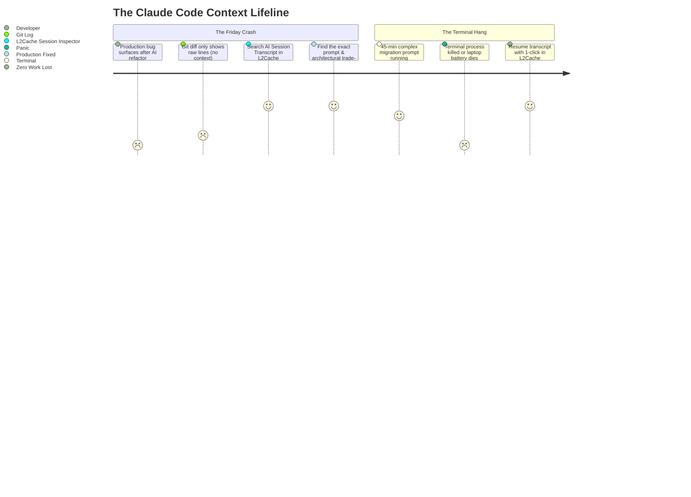

# How Claude Code Session History Can Save Your Production (and Your Sanity): 3 Real-World Scenarios

*When your AI agent refactors 20 files, executes terminal tests, and closes the terminal—where does the context go? Here is why saving and searching AI coding transcripts is a must-have for modern developers.*

---

Developers across the world are adopting **Claude Code CLI** and **OpenAI Codex** as autonomous pair programmers. They explore codebases, refactor legacy modules, write unit tests, and fix bugs directly from the command line.

**The catch?** The command-line interface is ephemeral:
* Close the terminal tab? **The conversation is gone.**
* Terminal crashes mid-execution? **Context lost.**
* A subtle bug surfaces in production 4 days after a merged AI PR? **Git diff shows what lines changed, but not *why* the AI chose that logic.**

Under the hood, tools like Claude Code write rollout events to local, hidden `.jsonl` transcript files (`~/.claude/projects/.../transcript.jsonl`). 

Here are **3 real-time developer scenarios** where having an instant, searchable session history isn't just a convenience—it's a lifesaver.

---



---

## Scenario 1: The 4:00 PM Friday Outage (The "Ghost Refactor")

### 🚨 The Problem
On Tuesday, you asked Claude Code to refactor your Node.js/Go payment service to support idempotent webhook retries. The AI did a phenomenal job, modified 14 files, ran the test suite (which passed), and you merged the PR.

Fast forward to **Friday at 4:15 PM**: Stripe webhook retries are randomly dropping 5% of incoming subscription renewals with a silent deadlock.

You inspect `git diff`:
```diff
- func ProcessWebhook(ctx context.Context, event Event) error {
-     return db.Transaction(func(tx *DB) { ... })
+ func ProcessWebhook(ctx context.Context, event Event) error {
+     lock := redis.AcquireLock(event.ID)
+     defer lock.Release()
+     return db.WithTimeout(ctx, 5*time.Second, ...)
```

The git commit message says *"Refactor webhook retries"*, but it doesn't tell you:
* *Why did the AI pick a 5-second Redis lock timeout instead of distributed leases?*
* *What edge cases did it explore and reject during its reasoning steps?*

### 💡 How Session History Saves You
Instead of spending 3 hours blindly guessing the AI's logic, you open **L2Cache’s Session Inspector** (or search your local transcripts):

```
[Session 2026-09-23 14:12:08 — Billing-Service]
User: "Refactor webhook retries to prevent duplicate processing..."
Claude Thought: "Evaluating Redis lock vs PostgreSQL SELECT FOR UPDATE. Choosing Redis with 5s timeout assuming high throughput..."
Claude Tool Execution: Ran command 'go test ./webhook -v' (Passed with 1 mock concurrency)
```

**The Aha Moment:** You immediately see that Claude assumed single-tenant throughput and only tested mock concurrency. You adjust the Redis lock renewal loop, deploy the patch in 10 minutes, and save your weekend.

---

## Scenario 2: The Accidentally Killed Terminal (45 Minutes of Context Vanished)

### 🚨 The Problem
You are 45 minutes into an extensive database migration and Kubernetes deployment script. You’ve given Claude Code multi-step instructions, provided schema snippets, API specs, and adjusted constraints across 8 conversational turns.

Suddenly:
* Your laptop battery hits 0% and hibernates, or
* You press `Ctrl + C` by accident, or
* The terminal emulator hangs and forces a restart.

You open a fresh terminal. **Everything is gone.** Trying to re-type 45 minutes of detailed context and file constraints from memory is painful and prone to missing critical requirements.

### 💡 How Session History Saves You
Claude Code and Codex log every message, prompt, and tool execution to disk in real-time. 

With **L2Cache**:
1. You open the session viewer overlay (`Cmd + Shift + V`).
2. Your exact session from 2 minutes ago is indexed at the top.
3. You review the last successful file edit and subagent output.
4. You copy the exact prompt state and resume the task with **zero lost time**:
   ```bash
   claude resume <session-id>
   ```

---

## Scenario 3: Recovering the "Genius Prompt" You Wrote 3 Weeks Ago

### 🚨 The Problem
Three weeks ago, you crafted an extraordinarily detailed prompt with complex regex constraints, AST parsing rules, and custom error boundaries that guided Claude Code to rewrite your legacy authentication middleware without breaking backward compatibility.

Today, you are assigned to migrate a second microservice that requires the **exact same migration pattern**.

You remember that the prompt worked like magic, but you can’t remember the exact 400-word phrasing, flag constraints, or edge-case warnings you gave the agent.

### 💡 How Session History Saves You
Without session history, your prompt is lost forever in terminal scrollback buffers.

With a searchable session history:
* You search for `AST auth migration` or `backward compatibility` in L2Cache.
* The exact prompt from September 4th appears in **<1ms with full syntax highlighting**.
* You copy the template, change the service name, and complete a 2-day refactoring task in 20 minutes.

---

## The Hidden Power: Token Analytics & Cost Awareness

When working with autonomous coding agents, subagents can sometimes enter recursive tool execution loops—reading files, running tests, failing, and retrying.

```
┌───────────────────────────────────────────────────────────┐
│ 📊 Claude Code Transcript Analytics (L2Cache)             │
├───────────────────────────────────────────────────────────┤
│ Session: auth-refactor-v2                                 │
│ Total Turns: 18 turns · 42 Tool Executions                │
│ Prompt Tokens: 184,200 · Completion Tokens: 24,900        │
│ Estimated API Cost: $1.14                                 │
└───────────────────────────────────────────────────────────┘
```

Having visibility into your transcripts lets you:
* Spot runaway context windows before they burn through your API quota.
* Audit what files and system directories the AI agent read during its execution.
* Maintain a secure audit trail of all automated terminal commands run on your Mac.

---

## Summary: Don't Treat AI Coding as Disposable

Autonomous AI agents are not simple autocomplete tools—they are junior engineers executing architectural decisions on your local machine.

Treating their prompts and reasoning transcripts as searchable developer assets gives you:
1. **Instant recovery from terminal crashes and dropped sessions.**
2. **Audit trails for production debugging and code review.**
3. **A reusable library of high-performing engineering prompts.**

---

### Tools to Inspect & Search Your AI Sessions Today

* **[L2Cache on the Mac App Store](https://apps.apple.com/us/app/l2cache/id6774423992?mt=12)**: The native macOS developer clipboard & AI history manager. Automatically indexes Claude Code and OpenAI Codex sessions offline with Touch ID security ($4.99 lifetime).
* **[Free Online Claude & Codex Session Viewer](https://l2cache.amvo.store/en/tools/claude-session-viewer)**: In-browser, 100% client-side tool to parse, search, and inspect `transcript.jsonl` files without uploading your code to any server.
* **[Claude Code Session History Guide](https://l2cache.amvo.store/en/claude-code-session-history-mac)**: Complete technical guide on transcript paths, JSON schema structures, and CLI resume commands.
