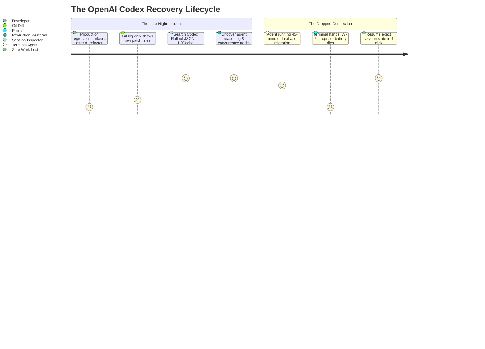

# How OpenAI Codex Session History Can Save Your Production (and Your Sanity): 3 Real-World Scenarios

*When your autonomous OpenAI Codex agent modifies 15 files, executes shell commands, runs tests, and the terminal closes—where did all that reasoning go? Here is why inspecting and searching Codex rollout transcripts is essential for modern engineers.*

---

Developers worldwide are embracing autonomous terminal agents powered by **OpenAI Codex** and **Claude Code**. Instead of merely autocompleting lines of code, these agents autonomously navigate repositories, execute shell commands, run test suites, apply multi-file AST patches, and self-correct when compilers complain.

**The catch?** The command-line interface is completely ephemeral:
* Close the terminal window or reboot your Mac? **The entire session scrollback disappears.**
* An agent hangs during a 40-minute migration or runs out of battery? **All multi-turn reasoning context is severed.**
* A subtle regression appears in staging 5 days after an AI pull request merges? **`git diff` reveals which lines changed, but provides zero insight into *why* the AI chose that architecture or what edge cases it failed to consider.**

Under the hood, OpenAI Codex CLI persists every prompt, tool execution, bash command, file diff, and prompt cache metric into structured rollout files on your disk:
```bash
~/.codex/sessions/YYYY/MM/DD/rollout-*.jsonl
~/.codex/memories.sqlite
```

Here are **3 real-world developer scenarios** where knowing how to inspect, search, and resume Codex session history is the difference between an effortless fix and a sleepless weekend.

---



---

## Scenario 1: The 4:00 PM Friday Deadlock (The "Silent Race Condition")

### 🚨 The Problem
On Wednesday, you tasked the OpenAI Codex CLI with refactoring a Go/PostgreSQL distributed worker service to process batch data exports concurrently with worker pools. 

Codex ran `go test ./...` in your terminal, all unit tests passed with 100% green checkmarks, and you merged the PR.

Fast forward to **Friday at 4:15 PM**: In production under peak traffic, the worker pool randomly deadlocks. Database connection pool exhaustion spikes to 100%, and incoming API requests begin timing out with HTTP 504.

You open `git diff`:
```diff
- func ProcessBatch(ctx context.Context, jobs []Job) error {
-     for _, job := range jobs {
-         if err := processJob(ctx, job); err != nil { return err }
-     }
-     return nil
- }
+ func ProcessBatch(ctx context.Context, jobs []Job) error {
+     var wg sync.WaitGroup
+     sem := make(chan struct{}, runtime.NumCPU()*2)
+     for _, job := range jobs {
+         wg.Add(1)
+         sem <- struct{}{}
+         go func(j Job) {
+             defer wg.Done()
+             defer func() { <-sem }()
+             processJob(ctx, j)
+         }(job)
+     }
+     wg.Wait()
+     return nil
+ }
```

The Git commit says *"Implement concurrent worker pool with semaphore"*. But Git cannot tell you:
* *Why did Codex choose a semaphore scaled to `NumCPU()*2` without limiting the underlying DB connection pool?*
* *Did the agent attempt an alternative transaction rollback strategy that failed during its reasoning cycle?*

### 💡 How Session History Saves You
Instead of spending hours blind-debugging in staging, you search your local Codex transcripts (using **L2Cache’s Session Inspector** or your favorite JSONL parser):

```json
{
  "type": "agent_thought",
  "session_id": "codex-rollout-2026-09-28T14-22-09Z",
  "content": "Analyzing ProcessBatch bottleneck. Database connection pool size is default (unspecified in local docker-compose). Creating goroutine semaphore scaled to runtime.NumCPU()*2 to maximize I/O throughput. Testing with 10 mock jobs..."
}
{
  "type": "tool_execution",
  "command": "go test ./worker -run TestProcessBatch -v",
  "exit_code": 0,
  "output": "PASS: TestProcessBatch (0.04s) [Using in-memory mock store]"
}
```

**The Instant Revelation:** Codex assumed production database connection pools were infinite because your local test suite used an in-memory mock store! The agent never tested real PostgreSQL connection contention.

You bound the semaphore to the configured SQL connection pool max limit, ship the patch in 12 minutes, and save your weekend.

---

## Scenario 2: The Severed Terminal (40 Minutes of Context Vanished)

### 🚨 The Problem
You are 40 minutes into a multi-step Kubernetes Helm chart overhaul and Terraform infrastructure refactoring. Across 9 conversational turns, you’ve provided Codex with ingress controller definitions, TLS cert-manager specs, subnet CIDR blocks, and strict VPC peering constraints.

Suddenly:
* Your laptop battery drops to 0% and hibernates,
* An accidental `Ctrl + C` or terminal tab closure kills the process, or
* A shell emulator update forces a restart.

You launch a fresh terminal. **Your workspace is partially modified, uncommitted, and the conversational context is completely gone.** Re-typing 40 minutes of intricate architectural constraints from memory risks missing security rules or breaking existing clusters.

### 💡 How Session History Saves You
OpenAI Codex logs every turn sequentially to disk in real-time. The session isn't lost—it's waiting in your rollout directory:
```bash
~/.codex/sessions/2026/09/28/rollout-175908234-a8f9.jsonl
```

With **L2Cache for Mac**:
1. Hit your global shortcut (`⌥ + Space`) or open the **[Free Offline Claude & Codex Session Viewer](https://l2cache.amvo.store/en/tools/claude-session-viewer)**.
2. The crashed session appears instantly at the top of your history.
3. Review the last applied patch, the active working directory, and the subagent's unfinished thought.
4. Resume execution seamlessly from terminal with the exact session UUID:
   ```bash
   codex resume a8f9-4b21-9982
   ```

**Zero lost time. Zero forgotten constraints.**

---

## Scenario 3: Recovering the "Holy Grail" Migration Prompt from 3 Weeks Ago

### 🚨 The Problem
Three weeks ago, you crafted a masterclass prompt containing strict AST transformation rules, custom TypeScript type guards, and backward-compatible deprecation decorators that allowed Codex to refactor a legacy Express.js API to Fastify in under 15 minutes without breaking frontend client contracts.

Today, your team asks you to perform the **identical migration** on a second mission-critical microservice.

You know the prompt worked flawlessly, but you cannot remember the exact 500-word prompt, the specific lint exclusions, or the architectural instructions you fed to the agent.

### 💡 How Session History Saves You
Without persistent session history, terminal scrollbacks are purged automatically by macOS and shell buffers.

With indexed session history:
* Search for `Fastify AST migration` or `Express type guards` in L2Cache.
* In **<1 millisecond**, the exact prompt, file arguments, and Codex execution timeline appear with full markdown and syntax highlighting.
* You copy the prompt template, swap the service endpoint names, and execute the migration before your standup.

---

## The Hidden Power: Token Analytics & Prompt Cache Hit Rates

Autonomous coding agents can consume substantial token volumes during recursive file exploration loops. Codex rollout logs contain rich telemetry that most developers never inspect:

```
┌───────────────────────────────────────────────────────────┐
│ 📊 OpenAI Codex Session Metrics (L2Cache Inspector)       │
├───────────────────────────────────────────────────────────┤
│ Session: k8s-helm-migration-v2                            │
│ Total Turns: 14 turns · 28 Tool Executions                │
│ Prompt Tokens: 242,100 · Cached Tokens: 218,000 (90.0%)   │
│ Completion Tokens: 18,450                                 │
│ Effective API Cost: $0.34 (Saved $2.18 via Prompt Cache)  │
└───────────────────────────────────────────────────────────┘
```

Inspecting your session metrics allows you to:
1. **Audit Prompt Cache Hit Rates**: Ensure your project context and system instructions are structured to hit OpenAI's 50% discount prompt cache window.
2. **Detect Subagent Thrashing**: Spot loops where an agent repeatedly runs failing tests or reads redundant node_modules files.
3. **Security & Data Compliance Audits**: Verify exactly what environment variables and source files Codex accessed during execution.

---

## Technical Reference: Where Codex Stores Data on macOS & Linux

| File / Directory | Purpose | Retention |
| :--- | :--- | :--- |
| `~/.codex/sessions/YYYY/MM/DD/rollout-*.jsonl` | Complete multi-turn transcripts, tool calls, and prompt metrics | Permanent (until manually purged) |
| `~/.codex/memories.sqlite` | SQLite database storing long-term project context & user habits | Persistent across sessions |
| `~/.codex/config.toml` | Model configurations, default tools, and approval thresholds | Config file |
| `~/.codex/history` | Raw terminal command-line prompt history | Standard shell log |

---

## Summary: Stop Treating AI Terminal Sessions as Ephemeral

Autonomous agents aren't basic code completions—they make real architectural decisions on your local files. 

Treating your AI session transcripts as permanent, searchable developer assets provides:
1. **Instant recovery from terminal crashes, Wi-Fi drops, and laptop sleeps.**
2. **Bulletproof audit trails for code reviews and post-mortem investigations.**
3. **A personalized, high-performance library of reusable engineering prompts.**

---

### Free Developer Tools & Resources

* **[Free Online Claude & Codex Session Viewer](https://l2cache.amvo.store/en/tools/claude-session-viewer)**: 100% private, client-side tool to parse, search, and inspect `rollout-*.jsonl` and `transcript.jsonl` files in your browser. Zero server uploads.
* **[L2Cache on the Mac App Store](https://apps.apple.com/us/app/l2cache/id6774423992?mt=12)**: Native macOS developer clipboard & AI session manager. Automatically indexes OpenAI Codex and Claude Code sessions offline with instant search (`⌥ + Space`) ($4.99 lifetime).
* **[OpenAI Codex Session History Technical Guide](https://l2cache.amvo.store/en/codex-session-history-mac)**: Complete deep dive into Codex rollout JSONL schemas, SQLite memory storage, and CLI flags.
* **[PasteGuard: Secret Sanitizer for AI Prompts](https://l2cache.amvo.store/en/tools/pasteguard)**: Free in-browser utility to strip API keys, private tokens, and database passwords before prompting AI agents.
* **[66+ Free Offline Developer Tools](https://l2cache.amvo.store/en/tools)**: Suite of private developer tools including fancy QR code stylists, Mermaid editors, JWT decoders, and regex visualizers.
