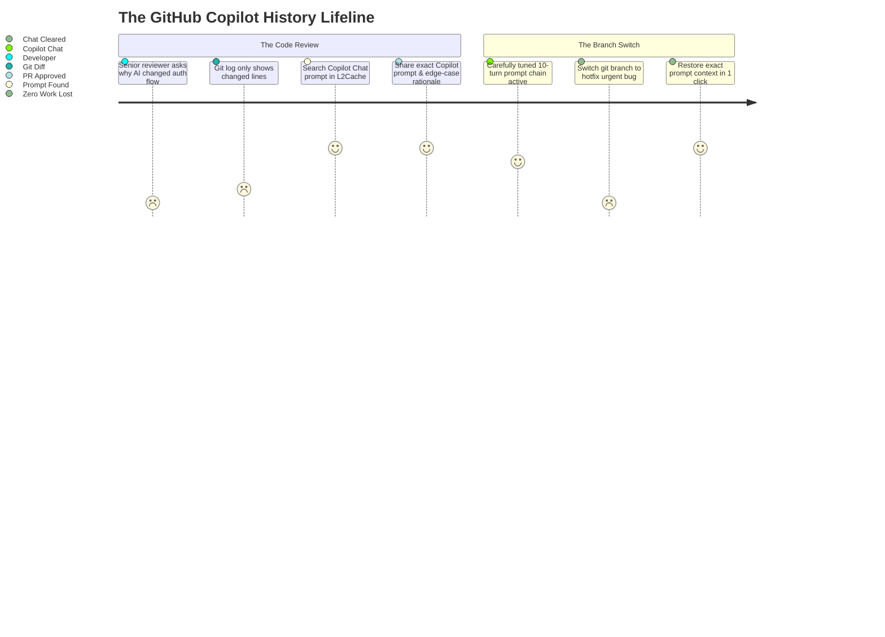

# Where Did My Copilot Context Go? How to View, Search, and Audit GitHub Copilot History: 3 Real-World Scenarios

*When GitHub Copilot Chat and Copilot Edits rewrite 8 files in your editor, execute unit tests, and you close the window—where does that conversation go? Here is why saving, searching, and auditing your Copilot prompt history is essential for modern engineers.*

---

**GitHub Copilot** has evolved far beyond ghost-text autocomplete. With the advent of **Copilot Chat**, **Copilot Edits** (agentic multi-file codebase modifications), and **GitHub Copilot CLI** (`gh copilot`), developers routinely use Copilot as an active pair programmer inside VS Code, Visual Studio, and JetBrains IDEs.

You feed Copilot entire workspace contexts, specify `@workspace` architectural boundaries, prompt it to modernize legacy frameworks, and guide it through complex refactors.

**The catch?** The IDE chat lifecycle is surprisingly ephemeral:
* Switch git branches or reload the VS Code window? **Your active Copilot Chat session context is wiped.**
* Close an editor tab or start a "New Chat"? **Previous prompt chains and code diffs get buried in obscure IDE cache directories.**
* A subtle regression surfaces in staging a week after merging an AI-assisted PR? **Git shows what lines changed, but provides zero record of *what prompt instructions steered Copilot to write that code*.**

Under the hood, VS Code stores chat sessions in obscure, hashed internal directories (`~/Library/Application Support/Code/User/workspaceStorage/.../chatEditingSessions/`), but navigating or searching these raw SQLite and JSON blobs is nearly impossible for developers.

Here are **3 real-world engineering scenarios** where having an instant, searchable history of your GitHub Copilot prompts and code outputs is an absolute lifesaver.

---



---

## Scenario 1: The Code Review Challenge (The "Why Did Copilot Do That?" Question)

### 🚨 The Problem
On Tuesday, you used **Copilot Edits** in VS Code to migrate an existing React 18 state management layer to modern React 19 actions and `useOptimistic` hooks across 6 components.

Copilot performed the refactor, tests compiled cleanly, and you opened a pull request.

During code review on Thursday, a Staff Engineer leaves a blocking review comment:
> *"Why did we wrap this server action in `startTransition` here, but inside `useActionState` in the parent container? This looks like it could trigger duplicate network requests during rapid clicks. What was the rationale?"*

You remember spending 20 minutes discussing this exact edge case with Copilot Chat, and Copilot proved that without `startTransition`, pending form states failed during micro-task flushes.

**The frustration:** You closed that VS Code window two days ago. The chat panel now says *"Start a new chat to ask Copilot anything..."*. You can't remember the exact React 19 RFC rule Copilot cited.

### 💡 How Session History Saves You
With **L2Cache for Mac**:
* Hit `⌥ + Space` and search `React 19 useOptimistic startTransition`.
* Instantly pull up the exact prompt and Copilot's response from Tuesday morning:

```markdown
User: "Why wrap form submission in startTransition if useActionState is already async?"
Copilot Chat: "In React 19, useActionState manages optimistic state updates, but if dispatched outside a transition boundary, React cannot defer background re-renders. Wrapping in startTransition marks the state mutation as non-blocking, preventing input lag while preserving optimistic rollback if the server rejects."
```

You paste Copilot's exact architectural rationale into the GitHub PR review. The staff engineer replies: *"Great catch on the React 19 transition boundary. Approved!"*

---

## Scenario 2: The Branch Switch Wipeout (Lost Context During an Urgent Hotfix)

### 🚨 The Problem
You are 35 minutes into a complex refactor with Copilot Chat. Across 7 iterative turns, you've supplied Copilot with custom type definitions, GraphQL schema fragments, and pagination edge cases. Copilot's in-memory context window is perfectly tuned to your specific requirements.

Suddenly, an **urgent P0 production hotfix** arrives. 

You stash your changes, switch to `hotfix/billing-patch`, fix the bug, and switch back to your feature branch.

You open VS Code. **Copilot Chat has reset.** The active memory context is blank. Trying to reconstruct 35 minutes of nuanced prompt constraints from memory is frustrating, error-prone, and burns valuable engineering time.

### 💡 How Session History Saves You
* Because **L2Cache** runs quietly in your macOS menu bar, every code snippet Copilot produced and every detailed prompt you composed is automatically indexed on your device.
* Hit `⌥ + Space`, browse your AI prompts from earlier this morning, and copy the full prompt sequence.
* Paste your master prompt back into Copilot Chat and resume working in **under 30 seconds**.

---

## Scenario 3: Enterprise Compliance & Code Provenance Auditing

### 🚨 The Problem
Your enterprise security and legal compliance team audits a new customer-facing payment integration. They flag a custom cryptographic signature verification function:
```typescript
function verifyWebhookSignature(payload: string, signature: string, secret: string): boolean {
  const hmac = crypto.createHmac('sha256', secret);
  hmac.update(payload, 'utf8');
  const digest = hmac.digest('hex');
  return crypto.timingSafeEqual(Buffer.from(signature), Buffer.from(digest));
}
```

The compliance auditor asks:
* *"Was this code hand-written, or generated by Copilot?"*
* *"If generated by AI, what prompts instructed it, and did it include public code with copyleft licenses?"*

Without a persistent log of your Copilot interactions, proving code provenance to auditors requires tedious guesswork.

### 💡 How Session History Saves You
With indexed prompt history:
* Search `verifyWebhookSignature timingSafeEqual` in L2Cache.
* Export the timestamped prompt showing you explicitly commanded Copilot:
  `"Write a timing-safe HMAC SHA-256 signature verification function in Node.js crypto using timingSafeEqual to prevent side-channel timing attacks."`
* You provide the compliance team with verifiable proof of the prompt instructions, demonstrating zero license contamination and intentional security design.

---

## Technical Reference: Where GitHub Copilot Stores Data on macOS & Linux

| Location | Purpose | Storage Format |
| :--- | :--- | :--- |
| `~/Library/Application Support/Code/User/workspaceStorage/<hash>/chatEditingSessions/` | VS Code Copilot Edits session cache | JSON / Temp files |
| `~/Library/Application Support/Code/User/globalStorage/state.vscdb` | Global VS Code state & chat metadata | SQLite database |
| `~/.config/github-copilot/` | Copilot CLI authentication & token cache | JSON / Config |
| `~/.bash_history` or `~/.zsh_history` | Raw `gh copilot suggest` terminal calls | Plaintext shell log |

---

## Summary: Stop Letting Your Best AI Prompts Evaporate

GitHub Copilot Chat and Copilot Edits aren't just autocomplete tools—they are conversational partners in your architectural workflow.

Treating your Copilot prompts and outputs as permanent, searchable developer assets ensures:
1. **Zero context loss when switching branches or restarting IDEs.**
2. **Defensible code provenance and architectural rationale during PR reviews.**
3. **A reusable library of high-performing prompts you can apply across every codebase.**

---

### Free Developer Tools & Resources

* **[L2Cache on the Mac App Store](https://apps.apple.com/us/app/l2cache/id6774423992?mt=12)**: The native macOS developer clipboard & AI history manager. Automatically indexes your Copilot prompts, Claude Code transcripts, terminal outputs, and code snippets offline with Touch ID security and instant global search (`⌥ + Space`) ($4.99 lifetime).
* **[PasteGuard: Secret Sanitizer for AI Prompts](https://l2cache.amvo.store/en/tools/pasteguard)**: Free client-side tool to redact API keys, database credentials, and private tokens before prompting GitHub Copilot or LLMs.
* **[Free Online Claude & Codex Session Viewer](https://l2cache.amvo.store/en/tools/claude-session-viewer)**: In-browser offline viewer for AI agent transcripts and JSONL logs with turn-by-turn diffs and token counters.
* **[Free Fancy QR Code Generator & Stylist](https://l2cache.amvo.store/en/tools/qr-code-generator)**: Create custom, high-scannability QR codes with rounded shapes, gradients, and brand backdrops 100% offline.
* **[66+ Free Offline Developer Tools](https://l2cache.amvo.store/en/tools)**: Suite of zero-upload, private developer utilities including JSON formatters, JWT decoders, regex visualizers, and SVG optimizers.
