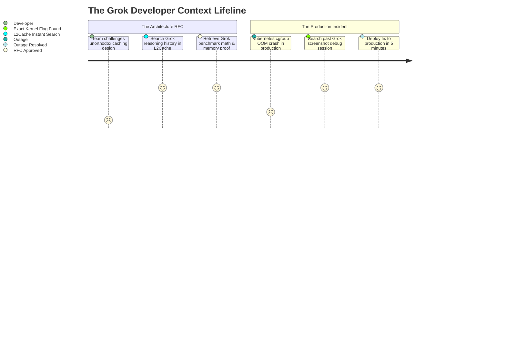

# How Grok Coding History Can Save Your Engineering Sanity: 3 Real-World Scenarios

*When xAI Grok crafts your high-performance data pipeline, refactors tricky algorithms, or dissects a cryptic panic log—where does that reasoning go? Here is why saving, searching, and auditing Grok coding sessions is a must-have for modern engineers.*

---

Software engineering with **xAI Grok** (Grok 2 and Grok 3) has surged across tech companies. Developers love Grok’s raw, unfiltered architectural honesty, its exceptional mathematical reasoning, and its willingness to challenge over-engineered design patterns where other models produce generic boilerplate.

Whether using Grok’s Web interface with deep "Think" reasoning mode, multimodal screenshot debugging, or terminal API integrations, engineers use Grok to solve their hardest technical hurdles.

**The catch?** The context lifecycle is completely ephemeral:
* Close your browser tab or clear your browser cookies? **Your prompt chain is lost.**
* Buried in an endless web sidebar with dozens of vague conversation titles? **Searching for that one custom SQL query or regex takes 20 minutes of endless clicking.**
* You copy a 40-line code snippet from Grok, paste it into your IDE, and test it. It works. Two months later, the system encounters an edge case—**and nobody knows *why* Grok structured the memory buffers that way.**

Here are **3 real-world engineering scenarios** where having an instant, searchable history of your Grok coding sessions transforms disaster into an immediate victory.

---



---

## Scenario 1: The RFC Architectural Defense (The "Uncensored Trade-Off")

### 🚨 The Problem
Three weeks ago, your team was planning a real-time event analytics feature. The initial design document proposed a heavy 4-component stack: Apache Kafka, Apache Flink, Redis, and ClickHouse.

You asked Grok 3 (with Deep Reasoning enabled) to stress-test the architecture for a team of 4 engineers handling 5,000 events/sec. 

Grok delivered a brutally honest critique:
> *"For 5,000 events/sec, running Kafka + Flink for 4 engineers is operational suicide. You will spend 70% of your sprint cycles babysitting ZooKeeper/Raft metadata and JVM garbage collection pauses. Use a single Redis Streams instance with consumer groups paired with PostgreSQL partitioned tables using `pg_partman`. Here is the benchmark proof and memory footprint calculation..."*

You adopted Grok's recommendation. It was faster, cheaper, and deployed in a single sprint.

**Fast forward to the Engineering Architecture Review (RFC):**
The Principal Architect questions the design:
* *"Why didn't we use standard Kafka topic partitions here?"*
* *"What is our exact memory saturation threshold before Redis backpressure triggers?"*

You remember Grok calculated the exact byte overhead per message and proven memory ceilings, but you can’t remember the exact numbers or mathematical formulas.

### 💡 How Session History Saves You
Without session history, your Grok conversation is buried under hundreds of chat sessions or lost forever.

With indexed session history in **L2Cache**:
* Hit `⌥ + Space` and search `Redis Streams 5000 events backpressure`.
* Instantly pull up the exact Grok reasoning transcript:

```
[Grok 3 Deep Reasoning Output — Sep 12]
Payload size: 240 bytes avg.
Redis Stream memory overhead: ~48 bytes per entry struct.
At 5,000 ops/sec: 1.44 GB/hour raw throughput.
With consumer group ACK trim (XTRIM MAXLEN ~ 50000):
Constant RAM floor = ~18.5 MB.
Network I/O = 1.2 MB/s (1.2% saturation on 1Gbps VPC).
Verdict: Kafka adds 12x RAM overhead and 4x operational latency for this tier.
```

You paste the mathematical proof directly into the RFC document. The architects approve the pull request with zero pushback.

---

## Scenario 2: The Cryptic Kubernetes Kernel Panic (Multimodal Debug Recovery)

### 🚨 The Problem
Last month, your team migrated a fleet of Go microservices to ARM64 Graviton instances on AWS EKS. During high network load, worker pods began mysteriously terminating with exit code `137` (OOMKilled)—despite your Datadog dashboards showing container memory usage at barely 45% of limits.

You took a screenshot of the AWS CloudWatch dmesg kernel log:
```
[18492.128491] cgroup: memory.high limit exceeded in /kubepods.slice/...
[18492.128504] memory.swap.current: 0, memory.zswap.current: 0
[18492.128519] Memory cgroup out of memory: Killed process 41829 (worker)
```

You dropped the screenshot into Grok's multimodal input:
* Grok analyzed the visual log, detected that Linux cgroups v2 `memory.high` throttling was interacting with Go’s runtime memory scavenger (`GOMEMLIMIT`), and pointed you to the exact flag to set:
```bash
export GOMEMLIMIT=90MiB
export GODEBUG=madvdontneed=1
```
It fixed the issue instantly.

**Two months later:** A different team in your company reports the exact same mystery crash on their Python services. You know you solved this with Grok, but you don't recall the esoteric kernel parameter name.

### 💡 How Session History Saves You
* Because **L2Cache for Mac** automatically indexes clipboard history, OCR text from screenshots, and AI prompts locally on your device:
* You search `GOMEMLIMIT` or `memory.high limit exceeded`.
* The exact Grok multimodal chat solution appears in **<1ms with zero cloud lag**.
* You send the 2-line fix to the team Slack channel in 30 seconds.

---

## Scenario 3: The "Genius Data Pipeline" Prompt You Wrote Weeks Ago

### 🚨 The Problem
You spent an entire afternoon crafting an intricate 700-word prompt instructing Grok to generate an asynchronous Python ETL pipeline using Polars and PyArrow. Your prompt specified:
* Strict memory chunking limits to prevent heap spikes on low-RAM container runners.
* Custom parquet schema coercion for legacy nullable datetime formats.
* Exponential backoff retry wrappers around AWS S3 multipart upload timeouts.

The script ran like a dream.

Today, your lead asks you to build a similar high-performance pipeline for customer billing data. You know that trying to re-prompt from scratch will take hours of trial and error to recreate all those fine-grained constraints.

### 💡 How Session History Saves You
Instead of starting from zero:
* You open your local prompt archive in L2Cache.
* Search `Polars PyArrow schema coercion`.
* Copy the exact prompt template, update the dataset column names, and have the new pipeline running in 15 minutes.

---

## The Privacy & Security Mandate: Protecting Your Code While Using AI

Grok is an exceptionally capable engineering tool, but pasting code into cloud LLMs carries security obligations:

```
┌───────────────────────────────────────────────────────────┐
│ 🛡️ Safe AI Prompting Checklist                           │
├───────────────────────────────────────────────────────────┤
│ 1. Strip AWS keys, JWT tokens & DB strings (Use PasteGuard)│
│ 2. Remove internal customer PII and company domains       │
│ 3. Store conversation history locally & encrypted (L2Cache)│
│ 4. Audit what secrets your terminal scripts output        │
└───────────────────────────────────────────────────────────┘
```

Before pasting debugging traces into Grok:
1. Run your code through **[PasteGuard](https://l2cache.amvo.store/en/tools/pasteguard)** (100% offline, free in-browser sanitizer) to redact API keys and bearer tokens.
2. Keep your saved transcripts stored locally on your own machine rather than relying solely on cloud provider retention policies.

---

## Summary: Make Your AI Prompts Permanent Developer Equity

Every hour you spend prompting Grok to solve hard engineering bugs, optimize queries, or derive algorithms represents **intellectual capital**.

Don't let that knowledge evaporate when you close your browser tab:
1. **Never re-solve the same production outage twice.**
2. **Back up your architectural RFC decisions with the original reasoning trace.**
3. **Build a personal library of proven, battle-tested AI prompts.**

---

### Free Developer Tools & Resources

* **[L2Cache on the Mac App Store](https://apps.apple.com/us/app/l2cache/id6774423992?mt=12)**: The native macOS developer clipboard & AI history manager. Automatically indexes your AI code prompts, terminal outputs, and snippets offline with Touch ID security and global hotkey search (`⌥ + Space`) ($4.99 lifetime).
* **[PasteGuard: Secret Sanitizer for AI Prompts](https://l2cache.amvo.store/en/tools/pasteguard)**: Free in-browser tool to strip API keys, private passwords, and tokens before prompting Grok, Claude, or ChatGPT.
* **[Free Online Claude & Codex Session Viewer](https://l2cache.amvo.store/en/tools/claude-session-viewer)**: In-browser offline viewer for AI agent transcripts and JSONL logs with turn-by-turn diffs and token counters.
* **[Free Fancy QR Code Generator & Stylist](https://l2cache.amvo.store/en/tools/qr-code-generator)**: Create custom, high-scannability QR codes with rounded shapes, gradients, and brand backdrops 100% offline.
* **[66+ Free Offline Developer Tools](https://l2cache.amvo.store/en/tools)**: Suite of zero-upload, private web utilities for developers, including JSON formatters, JWT decoders, regex visualizers, and SVG optimizers.
