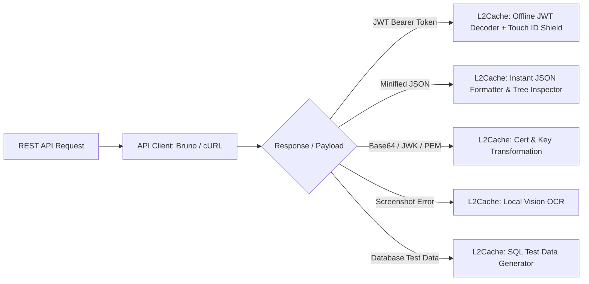

# The Modern REST API Developer Toolkit: How to Build, Debug, and Secure APIs on macOS

*Stop leaking production JWTs to public websites. From cURL and Bruno to offline JSON formatting, certificate decoding, and biometric secret protection—here is the ultimate REST API development workflow.*

---

If you build or debug backend REST APIs, your daily workflow revolves around HTTP payloads, auth headers, SQL queries, and error logs. 

Yet, most backend developers still rely on dangerous, fragmented habits:
1. Copying sensitive `Bearer eyJhbGciOi...` tokens and pasting them into **public online JWT decoders** (exposing company customer IDs and auth claims to third-party web servers).
2. Opening 5 different browser tabs for **JSON formatting, base64 decoding, and regex testing**.
3. Manually typing out 80-character UUIDs and stack traces from **Datadog or Slack error screenshots**.

Here is how modern REST API engineering on macOS should look—from API execution to offline smart transformations with **L2Cache**.

---



---

## 1. API Execution: Fast & Git-Friendly Clients

Modern API testing has moved away from heavy, cloud-synced, account-gated clients toward **local-first, git-friendly tools**:

* **[Bruno](https://www.usebruno.com/) / [HTTPie Desktop](https://httpie.io/):** Fast, lightweight, and stores your API collections in plain text files directly inside your git repository (no proprietary cloud sync).
* **cURL & HTTPie CLI:** The gold standard for terminal scripts and CI/CD pipelines.

---

## 2. Authentication & JWT Tokens: Stop Using Public Web Decoders

When an endpoint returns a `401 Unauthorized` or you need to verify OAuth2 claims, developers instinctively copy the token:

```
eyJhbGciOiJSUzI1NiIsInR5cCI6IkpXVCJ9.eyJzdWIiOiJ1c3JfMTI4OTQ4OTIiLCJuYW1lIjoiRGluZXNoIiwiZW1haWwiOiJkaW5lc2hAbDJjYWNoZS5hbXZvLnN0b3JlIiwicm9sZXMiOlsic3VwZXJhZG1pbiJdLCJpYXQiOjE3OTAzNzQ0MDAsImV4cCI6MTc5MDQ2MDgwMH0...
```

### 🚨 The Public Web Risk
Pasting this token into public websites like `jwt.io` sends your production claims, internal user IDs, and role permissions over the internet.

### 🛡️ The L2Cache Smart Action Solution
The moment you copy a JWT, **L2Cache’s on-device parser** detects the token format:
* **Instant Offline Claims Inspection:** Decodes the `Header`, `Payload`, `Algorithm`, `Issued At`, and human-readable `Expiration Date` in an instant floating HUD.
* **Touch ID Secret Shield:** Encrypts the raw authentication secret behind macOS biometric security so it cannot be viewed or leaked in plain text.

---

## 3. Handling Giant, Messy JSON Payloads

Backend microservices frequently return nested, unformatted, or minified JSON strings from database columns or log outputs.

```json
{"status":"error","code":500,"error":{"type":"DatabaseTimeoutException","details":{"query":"SELECT * FROM orders WHERE user_id = $1","timeout_ms":3000,"retries":3}}}
```

### The L2Cache Smart Action Solution
1. **Instant Prettifier & Tree Viewer:** With one keystroke (`Cmd+Shift+V`), L2Cache formats the JSON with colored syntax highlighting, line numbers, and collapsible object trees.
2. **Minifier:** Instantly collapse a 1,000-line JSON payload into a single minified line ready for a cURL body.
3. **Zero Browser Hopping:** No need to search for `jsonlint.com` or paste proprietary customer JSON into third-party web formatters.

---

## 4. Cryptographic Keys, JWK, and SSL Certificates

Building enterprise REST APIs with mutual TLS (mTLS) or OAuth2 identity providers (Auth0, Okta, Keycloak) requires juggling certificate formats:

* **JWK to PEM:** Converting JSON Web Key sets (`jwks.json`) into valid RSA/ECDSA public keys.
* **x509 Certificate Decoding:** Inspecting certificate validity, common names (CN), Subject Alternative Names (SANs), and expiry dates.
* **Base64 Encoding / Decoding:** Encoding binary payloads, images, and basic auth headers (`Authorization: Basic dXNlcjpwYXNz`).

**How L2Cache handles this:** Built-in offline smart transformers decode Base64 strings, convert JWKs to PEM format, and validate SSL certificates locally in memory.

---

## 5. Mock Data & SQL Generation: Seeding Local Databases

Before writing your endpoint handlers, you need realistic test data in PostgreSQL or MySQL.

Instead of writing repetitive `INSERT INTO` statements by hand:
* L2Cache’s **SQL Test Data Generator** produces valid, typed mock records (UUIDs, ISO-8601 timestamps, emails, pricing floats, and random foreign keys) with one click.

---

## 6. Screenshot Error OCR: Stack Traces Without Typing

During API integration testing, front-end developers and QA engineers often share screenshots of network errors, 502 Bad Gateway alerts, or Datadog traces in Slack:

```
Request URL: https://api.l2cache.amvo.store/v1/checkout/session
Status: 422 Unprocessable Entity
Error: Invalid UUID format in payload 'tenant_id'
```

### The L2Cache Smart Action Solution
* Take a region screenshot (`Cmd + Shift + 4`).
* L2Cache's **on-device Apple Vision OCR** extracts the plain text, URLs, and error strings instantly.
* Paste the exact URL or parameter name directly into your terminal or editor without retyping.

---

## 7. The Ultimate REST API Development Setup

Here is the recommended macOS toolkit for REST API engineers in 2026:

| Task | Recommended Mac Tool | Why It Wins |
| :--- | :--- | :--- |
| **API Client** | **Bruno / HTTPie** | Git-friendly, 100% offline, zero cloud account required |
| **Container Engine** | **OrbStack** | 2x faster than Docker Desktop, minimal battery drain |
| **Terminal & cURL** | **Warp / iTerm2** | GPU-accelerated shell with instant command search |
| **Clipboard & Smart Actions** | **[L2Cache](https://apps.apple.com/us/app/l2cache/id6774423992?mt=12)** | **Offline JWT decoder, JSON formatter, Base64/Cert tools, Touch ID secret encryption, and OCR** |
| **Local Database GUI** | **TablePlus** | Native Swift UI for Postgres, MySQL, and Redis |

---

### Summary: Keep Your API Secrets Local

Every time you paste an API key, connection string, or JWT into a cloud clipboard or online converter, you create a potential security risk.

Equip your Mac with native, offline-first tools:
* **Get [L2Cache on the Mac App Store](https://apps.apple.com/us/app/l2cache/id6774423992?mt=12)** ($4.99 one-time purchase, lifetime updates).
* **Try the free [Online Developer Utilities](https://l2cache.amvo.store/en/tools)** for offline browser-based JWT decoding, JSON formatting, and certificate validation.
